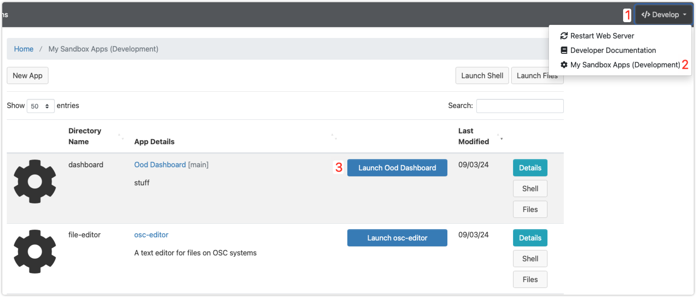

# Gautschi Open OnDemand Dashboard

## About

The [Gautschi Dashboard](https://www.rcac.purdue.edu/compute/gautschi), powered by [Open OnDemand](https://openondemand.org/), provides users a user-friendly graphical interface to access Gautschi resources.

## Documentation
Further documentation is located in the [Wiki](https://github.rcac.purdue.edu/RCAC-Staff/Gautschi-OOD-Dashboard/wiki).

## Enabling Developer Mode
1. The develop sandbox is controlled by the folder `/var/www/ood/apps/dev/user` and the linkage inside: `ln -s /home/user/ondemand/dev /var/www/ood/apps/dev/user/gateway`. It is also been pauperized from github repo (e.g. `Gautschi-Configuration` for Gautschi) so it's recommended to use github workflow to enable the develop mode.

   Go to github repo [Gautschi-Configuration](https://github.rcac.purdue.edu/RCAC-Staff/Gautschi-Configuration) and add the folder for `user` with link inside:
   ```bash
       # Go inside of the git repo Gautschi-Configuration folder
       cd puppet/modules/ondemand/files/var/www/ood/apps/dev
       # Create dev folder for "user" and configure the linkage
       user="user"; mkdir $user; ln -s /home/$user/ondemand/dev ./$user/gateway
       # Go through the general git commit process*
       # The change will be propagated to the system after next puppet run (you can manually do a `sudo run_puppet` on `adm.gautschi`).
   ```
   ^*Check the general git commit steps from [this wiki section](https://github.rcac.purdue.edu/RCAC-Staff/SupportKnowledgeBase/wiki/Staff-Admin-Workflows#general-steps-to-do-a-git-commit-under-a-rcac-git-repo).

   > Note: this action might have system-wide impact if not handling properly. Reach out to a RCAC staff to help on the steps.


## Installation

> Note: These installation instructions are solely for development use, not production deployment.

### 1. SSH into a login node

```bash
ssh user@gautschi.rcac.purdue.edu
```

### 2. Install dashboard using installation script

**Use git to clone the repository into your home directory** and then run the installation script:

- Using SSH
    > To use SSH for `git clone`, you must first set up a [Github SSH key](https://docs.github.com/en/authentication/connecting-to-github-with-ssh/adding-a-new-ssh-key-to-your-github-account) on the [Purdue Github](https://github.rcac.purdue.edu/settings/keys).
    ```bash
    git clone git@github.rcac.purdue.edu:RCAC-Staff/Gautschi-OOD-Dashboard.git $HOME/ondemand/dev/dashboard && cd $HOME/ondemand/dev/dashboard && ./install.sh
    ```

### 3. Open the dashboard



1. Click on Develop dropdown in top right.
2. Click on My Sandbox Apps (Development)
3. Click on Launch Ood Dashboard next to the app called Ood Dashboard \[main\]

Note: You can also run the dashboard locally by running `bundle exec rails server -b 0.0.0.0 -p 8080` in VSCode Remote SSH. VSCode will automatically forward ports to your local machine so you can access the dashboard through [http://localhost:8080/](http://localhost:8080/).

<!--
### 2. Alternative installation method

**Alternatively, you can perform the installation using curl or wget:**

- Using curl:
  ```bash
  curl -o- https://github.rcac.purdue.edu/RCAC-Staff/Gautschi-OOD-Dashboard/raw/main/install.sh | bash
  ```
- Using wget:
  ```bash
  wget -qO- https://github.rcac.purdue.edu/RCAC-Staff/Gautschi-OOD-Dashboard/raw/main/install.sh | bash
  ```
-->
