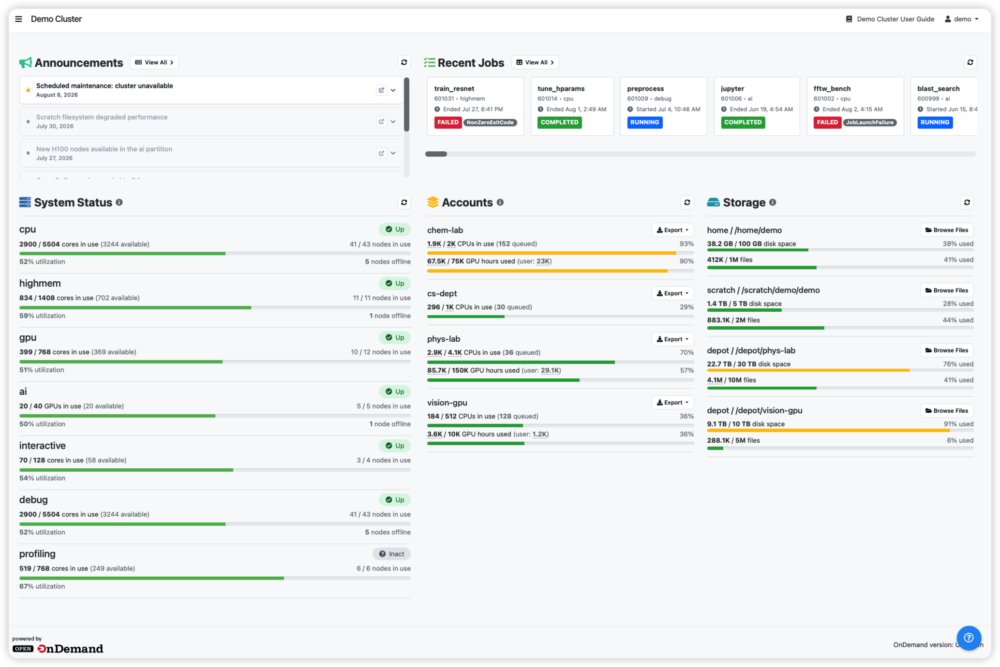

# HPC Dashboard

A drop-in replacement for the Open OnDemand dashboard that adds cluster-aware
monitoring: allocation balances, storage quotas, live Slurm partition and node
status, searchable job history with per-job efficiency metrics, and site
announcements — on top of everything the stock dashboard already does.

[](https://openondemand.org/)
[](https://slurm.schedmd.com/)
[](LICENSE)



> [!IMPORTANT]
> This is for **HPC system administrators** deploying a portal, not for end
> users. Installing it replaces the dashboard your users see — read
> [Known Limitations](docs/LIMITATIONS.md) first. Deploying as a sandbox app
> needs no root; replacing the system dashboard does.

## Try it first in demo mode

Before thinking about deploying this dashboard to your system, you can try all features in an interactive demo.

No Slurm, no Open OnDemand, no root required — stub scheduler tools serve a consistent
fake cluster (7 partitions, 82 nodes, 250 jobs, 4 allocations) so every page and
widget is populated. All jobs data are invented.

We've built a website to host the demo at: https://tinyurl.com/ood-dashboard-demo

If you want to play with the demo and build your own demo, please follow the options below.

### (Recommended) Option1: Container - Apptainer

Apptainer needs no root and is the path of least resistance on HPC.

```bash
apptainer build --ignore-fakeroot-command dashboard-demo.sif demo/apptainer.def
apptainer run --cleanenv dashboard-demo.sif
# open http://localhost:3000 or check with `demo/smoke.sh` (see below)
```

> `--cleanenv` matters: without it the host's `LD_PRELOAD` leaks in and the
> container will not start if anything pollutes it (e.g. XALT). 

### (Recommended) Option2: Container - Docker

A `demo/Dockerfile` mirrors it for Docker sites.

```bash
docker build -f demo/Dockerfile -t ood-dashboard:demo .
docker run --rm -p 3000:3000 ood-dashboard:demo
# open http://localhost:3000 or check with `demo/smoke.sh` (see below)
```

### Option3: Install all the required applications and gems

You can install all required applications and gems under your own space (`root` is not required), then try 
the demo using pre-installed packages with the commands below

```bash
git clone https://github.com/PurdueRCAC/OOD-Dashboard.git
cd OOD-Dashboard && bundle install && yarn install
OOD_DEMO_MODE=true bundle exec rails server -b 0.0.0.0 -p 3000
# open http://localhost:3000 or check with `demo/smoke.sh` (see below)
```

Needs Ruby 3.1–3.3, Node 16+ and Yarn 1.x on your `PATH`. Demo mode talks to no
PUN, so there is no Ruby ABI to match — any version the app runs under is fine
(verified on 2.7.8, 3.1.2 and 3.3.10). If you manage Ruby with rbenv, pin a
version you actually have (`rbenv local 3.3.8`): `rbenv local` on a version that
is not installed fails without writing anything, which silently stops the rest
of the `&&` chain.

or, **on the Open OnDemand web node** of a configured instance, you can just run

```bash
# Install all required packages, gems etc.
./install.sh
OOD_DEMO_MODE=true bundle exec rails server -b 0.0.0.0 -p 3000
# open http://localhost:3000 or check with `demo/smoke.sh` (see below)
```

Two things to know about this second path, because neither fails loudly:

- `install.sh` bundles for the **PUN's** Ruby, so run the demo on that same
  host. On a login node carrying a different Ruby, `bundle exec` reports
  `bundler: command not found: rails` — the gems are there, just under a
  different ABI directory.
- `install.sh` also creates `.env.local` from the example, and anything set
  there wins over the demo's own defaults. If your site config points the news
  feed at a real API, the Announcements widget comes back empty. Comment out the
  `OOD_NEWS_*` lines and restart — `.env.local` is only read at boot.

### Checking it works

You can open the assigned URL with port (defaults to http://localhost:3000) 
in the browser or use `demo/smoke.sh` to check in terminal.

See more details about using this demo in [DEMO](demo/README.md)

## Features

Everything below is *in addition to* the stock OOD dashboard's app launcher,
interactive sessions, Files, Projects, and Active Jobs.

<details>
<summary><b>Allocations and storage</b> — balances, service units, quotas</summary>

- **Balance and account widgets** — per-allocation service-unit balances and
  usage, with CSV/XLSX export. Reads Slurm accounting directly via `sacctmgr`
  and `scontrol show assoc`, **not** OOD's balance JSON. Which TRES an
  allocation is denominated in is configurable.
- **Storage widget** — quota and file-count usage per filesystem, with warnings
  as users approach limits and deep links into the Files app. Driven by a
  site-local quota command you name, **not** OOD's quota JSON.

</details>

<details>
<summary><b>Cluster monitoring</b> — partitions, nodes, reservations</summary>

- **System Status widget** — live Slurm partition state: node and core
  allocation, plus GPU allocation derived from `AllocTRES`/`CfgTRES`.
- **Cluster Status page** — every compute node with its state, load, and
  reservations, and a per-node detail page listing the jobs running on it.

</details>

<details>
<summary><b>Jobs and efficiency</b> — history, detail pages, utilization metrics</summary>

- **My Jobs** — searchable, column-filterable job history over an arbitrary date
  range, with charts for job state and GPU-hour distribution, and CSV/XLSX
  export.
- **Job detail pages** — full `scontrol`/`sacct` detail for a single job, linked
  from interactive sessions and My Jobs, with a Cancel action.
- **Per-job efficiency metrics** — CPU utilization, GPU utilization, and memory
  efficiency, via [jobstats](https://github.com/PrincetonUniversity/jobstats)
  (optional).
- **GPU-hour accounting** — used and reserved GPU hours per job, with
  configurable charged partitions, discounted QoS, and policy start date.
- **Performance Metrics page** — aggregate job efficiency trends for the user.

</details>

<details>
<summary><b>Communication</b> — announcements, help, support tickets</summary>

- **Announcements widget** — outage, maintenance, and announcement articles from
  a site news API, colour-coded by type, with active outages sorted first.
- **Dashboard Guide** — an in-portal help page explaining each widget.
- **Support ticket integration** — email or Request Tracker (RT) backends, using
  OOD's standard `support_ticket` configuration.

</details>

## Install it

Requires Open OnDemand (tested 2.0.32–4.2.2), the PUN's Ruby (its system or
OOD-bundled Ruby — 2.7 to 3.3 across tested portals), Node 16+, and Slurm client
commands reachable from the PUN host. Verified on four portals spanning OnDemand
2.0.32–4.2.2 (Rocky Linux 8–9, Ruby 2.7–3.3, Node 18.20.8) — see
[Known-good versions](docs/INSTALLATION.md#known-good-versions) for the full
list. Deploy as a sandbox app first — nothing your users see changes:

```bash
git clone https://github.com/PurdueRCAC/OOD-Dashboard.git \
  "$HOME/ondemand/dev/dashboard"
cd "$HOME/ondemand/dev/dashboard"
./install.sh
```

Run `install.sh` on the OOD web node — it detects and matches the PUN's Ruby
there (off-host, pass `PUN_RUBY_ABI`; see
[Installation](docs/INSTALLATION.md#2-clone-and-build)). Then launch it from
*Develop → My Sandbox Apps (Development)*.

**Every site-specific value is configuration — you should not need to edit any
view or controller.** Any feature whose configuration is missing hides itself or
reports `N/A` rather than erroring, so this boots and behaves like the stock
dashboard before you configure anything. Two values are worth setting right
away:

```bash
OOD_SITE_NAME="Your Cluster"
OOD_DASHBOARD_DOCS_URL="https://docs.example.edu/"
```

➡️ **[Quick Start](docs/QUICKSTART.md)** — the full evaluation path, about an hour
&nbsp;·&nbsp; **[Installation](docs/INSTALLATION.md)** &nbsp;·&nbsp;
**[Configuration](docs/CONFIGURATION.md)**

## Documentation

| Document | What's in it |
|---|---|
| [Quick Start](docs/QUICKSTART.md) | Evaluation path for a Slurm site, touching nothing your users see |
| [Installation](docs/INSTALLATION.md) | Requirements, deployment modes, build, verification checklist |
| [Configuration](docs/CONFIGURATION.md) | Every `OOD_*` key, grouped by feature, with defaults and formats |
| [Troubleshooting](docs/TROUBLESHOOTING.md) | Symptom-first fixes for empty widgets, missing metrics, stale assets |
| [Known Limitations](docs/LIMITATIONS.md) | What this fork does not do, and what needs site-local work |
| [Development](docs/DEVELOPMENT.md) | Working on the dashboard itself |
| [Architecture](docs/ARCHITECTURE_OVERVIEW.md) | Which files implement each widget and page |
| [Demo mode](demo/README.md) | Running the whole dashboard with an invented cluster behind it |

## Before you deploy

<details>
<summary><b>Four things worth knowing up front</b></summary>

- **Slurm only.** The monitoring features parse Slurm command output. Other
  schedulers keep app launching but lose those pages.
- **You are adopting a fork.** This replaces the OOD dashboard rather than
  installing alongside it, so upstream updates must be merged in, not applied by
  upgrading OOD.
- **Two features need site-local work.** The news feed assumes Purdue RCAC's API
  shape, and the Storage widget needs a quota command you supply.
- **There is no automated test suite.** Upstream's tests were not carried into
  this fork. Changes are verified manually against a sandbox deployment.

Full detail in [Known Limitations](docs/LIMITATIONS.md).

</details>

## Contributing

Fork, branch, and open a pull request describing your changes. Please keep
site-specific values out of views and controllers — add a key to
`site_string_configs` in `config/configuration_singleton.rb` and document it in
`.env.local.example` instead. See [Development](docs/DEVELOPMENT.md).

For bugs or feature requests,
[open an issue](https://github.com/PurdueRCAC/OOD-Dashboard/issues).

This app is part of the
[OOD Appverse](https://openondemand.connectci.org/affinity-groups/ood-appverse).

<details>
<summary><b>References</b></summary>

- [Open OnDemand](https://openondemand.org/) — the portal framework
- [OSC/ondemand](https://github.com/OSC/ondemand) — upstream dashboard this is
  forked from (`apps/dashboard`)
- [jobstats](https://github.com/PrincetonUniversity/jobstats) — per-job
  efficiency metrics
- [Slurm_tools `showpartitions`](https://github.com/OleHolmNielsen/Slurm_tools/blob/master/partitions/showpartitions)
  — the partition status widget's Slurm queries are derived from this
- [OOD app development guide](https://osc.github.io/ood-documentation/latest/how-tos/app-development.html)

The balance and service-unit widgets originate in the Anvil OOD dashboard.

</details>

## License

[MIT License](LICENSE) — © Ohio Supercomputer Center (upstream dashboard) and
Purdue University Research Computing.

Built by [Purdue University Research Computing (RCAC)](https://www.rcac.purdue.edu/)
on top of Open OnDemand, which is supported by the National Science Foundation under 
[Grant No. 2005632](https://www.nsf.gov/awardsearch/showAward?AWD_ID=2005632).
